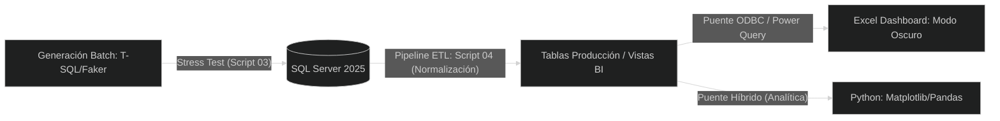

# 📘 Documentación Técnica

## Proyecto P1: Control de Inventarios & Fundamentos Relacionales (V3.0)

🗂️ **P1: Inventario y Logística** (Gestión de Stock y Trazabilidad)

> *"Elimina la obsolescencia de inventarios y los quiebres de stock
> mediante un modelado relacional riguroso que automatiza el control de
> existencias. Garantiza una visibilidad en tiempo real de la cadena de
> suministro, optimizando los costos de almacenamiento operativo."*
>

---

## Resumen Ejecutivo

Proyecto de ingeniería de datos enfocado en la simulación de entornos
legacy mediante la generación deliberada de datos no atómicos y su
posterior remediación mediante procesos ETL en SQL Server.

## Descripción general

Proceso fundamentado en el rigor transaccional y en la lógica de
normalización, diseñado para manejar de forma deliberada datos
**no atómicos** con el objetivo de simular entornos legacy. Su enfoque
principal es la remediación, lograda a través de un pipeline ETL que
convierte el ruido en **Inteligencia de Negocio**.

---

### 🎯 Objetivo

*Generar un ecosistema capaz de ingerir y procesar un volumen de
transacciones, demostrando eficiencia con una integración híbrida entre
lenguajes de programación y motores de base de datos. Aplicando principios
de ingeniería de datos para garantizar la integridad, consistencia y calidad
de los datos, mediante un pipeline capaz de transformar información
operacional con problemas de calidad en activos analíticos confiables para la
toma de decisiones.*



---

## **🏗️ Ciclo de Vida del Dato (Evolución Técnica)**

- **Fase 1: Arquitectura & Esquemas (Script 01)**

  - Segmentación por esquemas: `Inventario` (Maestros) y
    `Operaciones` (Transacciones).
  - Implementación de integridad referencial (`PK`, `FK`) y
    restricciones `CHECK` para calidad de origen.
- **Fase 2 y 3: Simulación de Carga Masiva (Scripts 02 y 03)**

  - Poblado de 500+ registros bajo estrés en < 2 segundos.
  - **Inyección de Datos Legacy:** Simulación intencional de
    datos compuestos (ej. `Mérida | YUC`) para probar el
    pipeline de limpieza.
- **Fase 4: Pipeline ETL & Data Grooming (Script 04) 💎**

  - **Normalización 1NF:** Extracción atómica de atributos mediante
    `SUBSTRING` y `CHARINDEX`.
  - **Data Grooming:** Estandarización de capitalización (Formato
    Título) y corrección universal de acentos.
  - **Idempotencia:** Script diseñado para correr múltiples veces
    sin degradar la calidad del dato.
- **Fase 5: Conectividad BI & Dashboard (Script 05)**

  - Vistas analíticas conectadas vía **ODBC** a Excel.
  - Visualización de métricas críticas: Stock debajo del mínimo,
    tendencias de venta y semáforos operativos.

### Valor de Negocio

Este proyecto demuestra cómo una organización puede transformar
información operativa con problemas de calidad en activos de datos
confiables para la toma de decisiones.

Este enfoque replica escenarios comunes en organizaciones que operan
sobre sistemas heredados, permitiendo demostrar capacidades reales de
ingeniería de datos orientadas a calidad, gobierno y explotación
analítica de la información.

#### Beneficios obtenidos

- Mejora de calidad del dato.
- Eliminación de redundancia.
- Estandarización de registros.
- Disponibilidad para análisis.
- Integración con herramientas BI.

### Arquitectura

* [Arquitectura Lógica](architecture/01_logical_architecture.drawio)
* [Arquitectura Física](architecture/02_physical_architecture.drawio)
* [Arquitectura de Despliegue](architecture/03_deployment_architecture.drawio)

---

## **📊 Indicadores de Performance Final**


| Métrica          | Anterior           | Optimizado                 |
| :------------------ | :------------------- | :--------------------------- |
| Atomicidad        | Datos no atómicos | Datos normalizados         |
| Consistencia      | Ruido ortográfico | Grooming global            |
| Performance Batch | Carga no validada  | ~1,800 ms (500+ registros) |
| Conectividad BI   | Datos aislados     | Bridge ODBC activo         |

### Estrategia de Calidad

Se ejecutan validaciones automáticas:

- Nulos.
- Duplicados.
- Integridad Referencial.
- Reglas de Negocio.

---

## Observabilidad y métricas

Se implementó monitoreo de ejecución mediante registros de tiempo y
volumen procesado para evaluar el desempeño del pipeline y documentar
evidencias objetivas de rendimiento.


| Métrica               | Resultado             |
| ------------------------ | ----------------------- |
| Registros Procesados   | 3,200                 |
| Tiempo ETL             | < 1 segundo           |
| Tiempo Batch           | 1.7 segundos          |
| Integridad Referencial | 100%                  |
| Registros Rechazados   | 0                     |
| Throughput Aproximado  | ≈1,900 registros/seg |

## 📊 Ejemplo de métricas de ejecución (V1.0)


| # | Dim.           | Registros | Operación        | Rendimiento |
| :-: | :--------------- | :---------- | :------------------ | :------------ |
| 1 | Carga          | 3,200     | Inserción masiva | 1,776 ms    |
| 2 | Integridad     | 100 %     | PK/FK y CHECK     | Verificado  |
| 3 | Normalización | 500+      | ETL metadata      | < 1 s       |

---

## **📂 Estructura del Repositorio (Sincronizada)**

```text
P1_Inventario/
│
├── architecture/
│   ├── 01_logical_architecture.drawio
│   ├── 02_physical_architecture.drawio
│   └── 03_deployment_architecture.drawio
│
├── assets/
│   ├── img/                                # Capturas de pantalla y diagramas ERD
│   └── reports/
│
├── Dashboard/
│   └── 05_Dashboard_Operativo_P1.xlsx      # Reporte ejecutivo conectado vía ODBC.
│
├── data_sample/
│
├── docs/
│   ├── decisions/
│   ├── functional/
│   ├── operations/
│   └── technical/
│
├── scripts/
│   ├── 01_Setup_DDL.sql
│   ├── 02_DML_Seed.sql              # Datos semilla para validación inicial.
│   ├── 03_Procesamiento_Batch.sql   # Stress test y simulación de volumen.
│   ├── 04_ETL_Limpieza.sql          # Pipeline de normalización y Data Quality
│   └── 05_BI_Analytics.sql          # Capa de vistas para consumo externo.
│
├── tests/
│
├── requirements.txt
│
└── README.md                        # Guía técnica del proyecto.
```

---

## **🔓 Key Engineering Features**

- **Idempotencia:** Scripts diseñados con `DROP IF EXISTS` y validaciones
  `NOT EXISTS` para despliegues continuos.
- **Data Grooming:** Proceso automatizado de corrección de capitalización y
  limpieza de caracteres especiales.
- **Seguridad Transaccional:** Bloques `TRY…CATCH` con `ROLLBACK` automático
  para garantizar la integridad en cargas masivas.
- **Calidad de Datos:** Framework de QA automatizado para detección de
  nulos, duplicados, violaciones de reglas de negocio e inconsistencias
  referenciales.

---

## 🚀 Cómo Ejecutar

1. Clonar el repositorio.
2. Configurar el **DSN de Sistema** en el Administrador de Orígenes de
   Datos ODBC (Driver 17) apuntando a `P1_Inventario`.
3. Ejecutar los scripts en orden secuencial (**01 al 05**) en SQL Server
   Management Studio o VS Code.
4. Abrir el archivo `05_Dashboard_Operativo_P1.xlsx` y seleccionar
   **Datos > Actualizar Todo**.
5. Ejecutar los scripts contenidos en la carpeta `/tests`.
6. Validar que todas las pruebas regresen cero incidencias.
7. Actualizar el Dashboard para visualizar resultados finales.

---

## **🔧 Tecnologías**

- SQL Server 2025
- T-SQL
- ODBC Driver 17
- Excel
- Power Query
- Power BI
- Git
- Draw.io

---

## **🧠 Retos Técnicos y Soluciones de Ingeniería**

### Durante el desarrollo del Proyecto P1 (Inventario)

Se resolvieron desafíos críticos mediante estándares de la industria

1. **Gestión de Identidades en Ciclos de Stress Test**
   - **Problema:** Las cargas masivas repetidas no reiniciaban los contadores
     `IDENTITY`, causando que los IDs crecieran indefinidamente y dificultando
     la validación de reportes legacy.
   - **Solución:** Se integró lógica de limpieza profunda que garantiza que cada
     ejecución del pipeline inicie desde el ID 1, asegurando la
     **repetibilidad de escenarios de prueba**.
   - **Impacto:** Facilitó la creación de benchmarks de rendimiento confiables
     y garantizó que las relaciones entre `Pedidos` y `Pagos` fueran siempre
     predecibles.
2. **Blindaje contra Propagación de Nulos (NULL Propagation)**
   - **Problema:** En la generación aleatoria de datos (Fase 3), funciones no
     deterministas como `CHOOSE` podían devolver `NULL`, rompiendo la
     integridad de las columnas `NOT NULL`.
   - **Solución:** Se implementó protección con `ISNULL(@Variable, 'Default')`
     y validaciones previas a la inserción.
   - **Impacto:** Se alcanzó un **100% de éxito en la ingesta masiva**,
     eliminando fallos por inconsistencias en la lógica de generación
     aleatoria.
3. **Normalización de Datos No Atómicos (ETL Robusto)**
   - **Problema:** Ingesta de datos "Legacy" en formatos compuestos como
     `Sucursal | Ciudad`. Esto impedía el filtrado y la agregación en el
     Dashboard.
   - **Solución:** Se diseñó un pipeline de limpieza basado en `SUBSTRING`,
     `CHARINDEX` y `TRIM`, sumado a una capa de **Data Grooming** para
     estandarizar acentos y capitalización de forma masiva.
   - **Impacto:** Transformó información cruda en **insumos analíticos puros**,
     permitiendo que el Dashboard de Excel agrupe ventas y stock de forma
     exacta sin duplicados por errores ortográficos.
4. **Métricas de Performance Transaccional**
   - **Problema:** Dificultad para cuantificar el impacto del procesamiento
     batch en el servidor.
   - **Solución:** Estandarización de logs de ejecución mediante
     `SYSUTCDATETIME()`, capturando el tiempo de proceso en milisegundos y el
     volumen de filas afectadas.
   - **Impacto:** Proporcionó **evidencia objetiva de rendimiento**, reportando
     cargas masivas exitosas en menos de 1,800 ms, facilitando la comunicación
     de resultados a nivel ejecutivo.

---

### Componentes


| Componente | Responsabilidad                                       |
| ---------- | ----------------------------------------------------- |
| Script 01  | Definición de arquitectura y objetos de base de datos |
| Script 02  | Generación de datos semilla                           |
| Script 03  | Simulación de carga masiva                            |
| Script 04  | Limpieza, normalización y calidad de datos            |
| Script 05  | Exposición analítica mediante vistas                  |

### 🏬 ADR Implementados

#### Architecture Decision Records


| ADR     | Descripción                                    |
| --------- | ------------------------------------------------- |
| ADR-001 | Segmentación por dominios y datos no atómicos |
| ADR-002 | Vistas analíticas consolidadas                 |
| ADR-003 | Framework de calidad de datos                   |
| ADR-004 | Idempotencia y resiliencia transaccional        |

### 🔎 QA Framework

El marco de calidad del dato se basa en la validación automatizada de los datos
antes de exponerlos a las capas analíticas y de visualización.


| Validación                    | Objetivo                          |
| -------------------------------- | ----------------------------------- |
| test_nulls.sql                 | Detectar nulos críticos          |
| test_duplicates.sql            | Detectar duplicados               |
| test_business_rules.sql        | Validar reglas operativas         |
| test_referential_integrity.sql | Garantizar integridad referencial |

Resultado esperado:

- 0 registros con nulos críticos.
- 0 registros duplicados.
- 0 violaciones de reglas de negocio.
- 0 registros huérfanos.

## 📚 Evidencias de Ejecución


| Evidencia              | Descripción               |
| ------------------------ | ---------------------------- |
| 01_architecture.png    | Diagramas de arquitectura  |
| 02_batch_execution.png | Ejecución de carga masiva |
| 03_etl_execution.png   | Proceso ETL                |
| 04_qa_validation.png   | Validaciones QA            |
| 05_dashboard.png       | Dashboard operativo        |

---

## 📅 Próximos Pasos (Roadmap)

V2

* Fuzzy Matching
* Automatización Batch
* Python Analytics Layer

V3

* API Layer
* Dashboard Web
* Observabilidad

---

**Autor:** Jesús Alberto Dzib Ku
Ingeniero Electrónico | Especialidad en Mecatrónica Industrial
Data Analytics • BI • Data Engineering
**Versión:** 3.0.0
