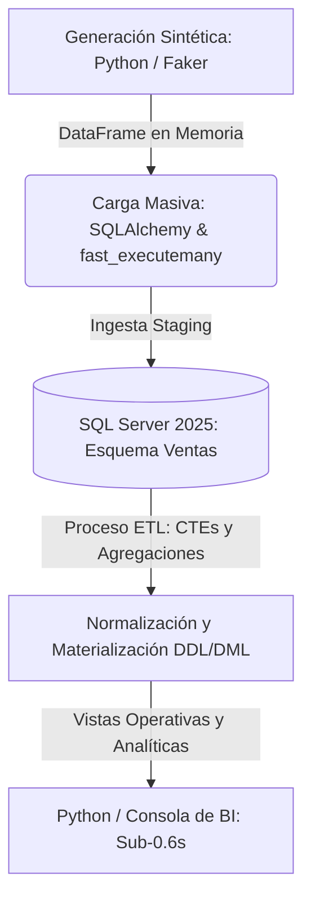

# 🔄 Diagrama de Flujo de Datos - P3_Retail_Ventas

El flujo de datos híbrido garantiza la trazabilidad, atomicidad y velocidad
 de procesamiento en el pipeline:

```mermaid
graph TD
    A[Generación Sintética: Python / Faker] -->|DataFrame en Memoria| B(Carga Masiva: SQLAlchemy & fast_executemany)
    B -->|Ingesta Staging| C[(SQL Server 2025: Esquema Ventas)]
    C -->|Proceso ETL: CTEs y Agregaciones| D[Normalización y Materialización DDL/DML]
    D -->|Vistas Operativas y Analíticas| E[Python / Consola de BI: Sub-0.6s]
```
