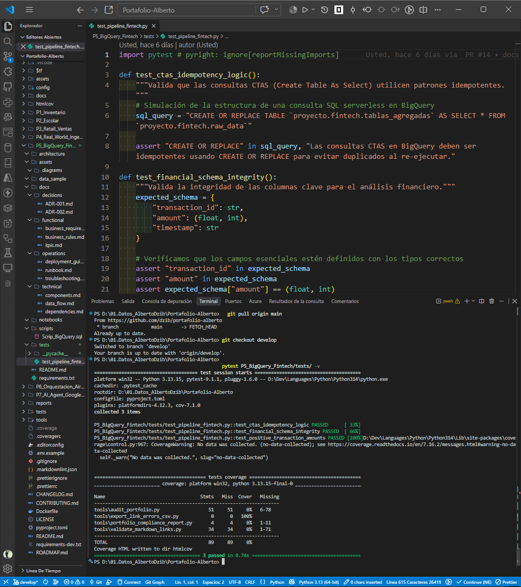
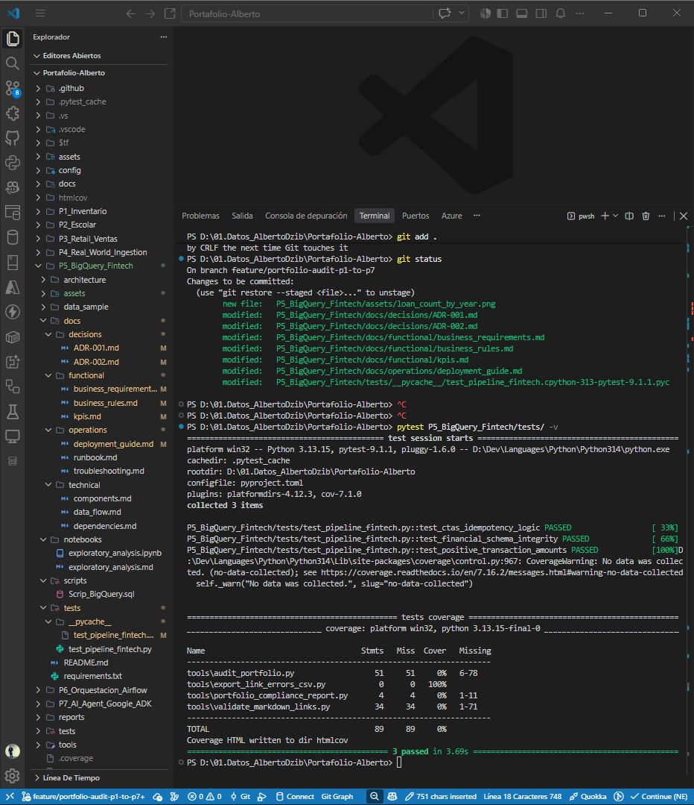

# Portafolio: Análisis y Agregación de Datos en BigQuery

## ☁️ P5_BigQuery_Fintech — BigQuery Fintech Pipeline (Analítica Cloud y Escalabilidad)

"Automatiza la agregación de datos financieros transaccionales en entornos cloud
serverless mediante consultas idempotentes. Reduce la latencia analítica y
garantiza la gobernanza estricta para auditorías regulatorias."

## 📌 Contexto del Proyecto

Este proyecto demuestra habilidades prácticas en **Google Cloud BigQuery**
para el procesamiento de datos financieros. A partir de una base de datos transaccional
de préstamos (dataset `fintech`), se requería optimizar las consultas analíticas
futuras.

## 🎯 El Desafío

El objetivo principal fue evitar el escaneo repetitivo de datos a nivel
granular mediante la creación de una tabla agregada. Utilizando la declaración
`CTAS` (Create Table As Select), se generó un resumen eficiente que contabiliza
la cantidad total de préstamos emitidos agrupados por año (`issue_year`).

### 🖼️ Objetivo

Implementar un pipeline analítico de alto rendimiento y optimización de
costos en **Google Cloud BigQuery** para procesamiento financiero masivo. A
partir de una base de datos transaccional de préstamos (`fintech.loan`), se
diseñó una estrategia de agregación mediante la declaración `CTAS` (Create
Table As Select) con el patrón de idempotencia `CREATE OR REPLACE`,
eliminando el escaneo repetitivo de datos granulares.

```mermaid
graph TD
    subgraph "Fase 01: Inversión y Contrato de Datos"
    A[Dataset Transaccional: fintech.loan]
    B[Esquema de Préstamos Granular]
    A -->|Google Cloud BigQuery| B
    end

    subgraph "Fase 02: Procesamiento Idempotente"
    B -->|CTAS: CREATE OR REPLACE TABLE| C[Tabla Agregada: fintech.loan_count_by_year]
    end

    subgraph "Fase 03: Pruebas y Gobernanza"
    C -->|pytest Automation| D[Validación de Esquema y Pipeline en Verde]
    D -->|Visual Assets & Evidence| E[Auditoría y Trazabilidad]
    end

    style A fill:#f9f,stroke:#333,stroke-width:2px
    style C fill:#bbf,stroke:#333,stroke-width:2px
    style D fill:#dfd,stroke:#333,stroke-width:2px
    style E fill:#ffd,stroke:#333,stroke-width:4px

## 🚀 Retos Técnicos a Resolver

**Optimización de Costos en Cloud:** Reducción drástica del volumen de
bytes escaneados en consultas analíticas recurrentes sobre tablas
particionadas.

**Idempotencia Operativa:** Garantizar que los scripts CTAS puedan ejecutarse
de forma repetible y segura sin duplicar estados o generar excepciones de
objetos existentes mediante `CREATE OR REPLACE`.

**Automatización de Calidad (QA):** Integración de pruebas unitarias
automatizadas con pytest para validar la correcta ejecución de la tubería
analítica en entornos cloud.

## 🏗️ Estructura Completa del Proyecto (Modular & Production-Ready)

El módulo está estructurado bajo una arquitectura desacoplada y estricta:

`architecture/`: Documentación conceptual y diagramas de diseño del pipeline
en BigQuery.

`assets/`: Evidencias visuales, diagramas y capturas de consola para
auditoría externa.

`data_sample/`: Muestras de datos estructuradas para pruebas locales y
validación de esquemas.

`docs/`: Documentación técnica, decisiones de arquitectura (ADRs),
requerimientos funcionales y manuales de operaciones.

`notebooks/`: Cuadernos interactivos para análisis exploratorio de datos
(EDA) y pruebas de concepto.

`scripts/`: Sentencias y scripts optimizados en Standard SQL para BigQuery.

`tests/`: Pruebas unitarias de integración automatizadas con pytest.

`requirements.txt`: Dependencias técnicas del ecosistema de Python/BigQuery.

`README.md`: Documentación principal del módulo.

📂 Mapa Estructural

```text
P5_BigQuery_Fintech/
├── architecture/       # Diagramas y modelos conceptuales
├── assets/              # Evidencias visuales y diagramas
│   ├── diagrams/
│   └── evidence/        # Capturas de ejecución y consola GCP
├── data_sample/         # Muestras de datos y metadatos
├── docs/                # Documentación de ingeniería y gobernanza
│   ├── decisions/       # Registros de decisiones de arquitectura
│   ├── functional/      # Requerimientos y reglas de negocio
│   ├── operations/      # Guías de despliegue y troubleshooting
│   └── technical/       # Componentes, flujos y dependencias
├── notebooks/           # EDA y validación analítica interactiva
├── scripts/             # Scripts SQL de agregación y modelado
├── tests/               # Pruebas automatizadas con pytest
├── requirements.txt     # Dependencias de Python
└── README.md            # Documentación principal
```


## 💻 Solución SQL e idempotencia

El script principal automatiza la agregación anual de préstamos mediante
Standard SQL en Google Cloud:

```sql
CREATE OR REPLACE TABLE fintech.loan_count_by_year AS
SELECT
    issue_year,
    COUNT(loan_id) AS total_loans
FROM fintech.loan
GROUP BY issue_year;
```

## 📊 Resultados y esquema de salida

La ejecución aprovisionó la tabla `loan_count_by_year` con este contrato:

- `issue_year` (**NUMERIC**): Año fiscal de emisión de los créditos.
- `total_loans` (**INTEGER**): Conteo de préstamos por período.

## 📸 Evidencias visuales y trazabilidad

Las capturas de pantalla que validan la ejecución correcta del script en la
consola, la estructura en VS Code y los resultados de las pruebas unitarias
automatizadas (`pytest`) se encuentran organizadas en la ruta oficial de
evidencias:

* 
* 

Puedes consultar las evidencias visuales (capturas de la consola de GCP y el
esquema resultante) en el documento PDF adjunto a este repositorio.

## 📝 Bitácora de troubleshooting y decisiones

1. **Control de idempotencia en BigQuery**

   - **Reto:** Evitar fallos al reejecutar scripts de creación de tablas.
   - **Solución:** Usar `CREATE OR REPLACE TABLE` para actualizar el modelo
     analítico de forma limpia y atómica.

1. **Sincronización de entornos de pruebas**

   - **Reto:** Aislar las pruebas de integración de los componentes cloud.
   - **Solución:** Estructurar pruebas con pytest y validarlas localmente.

## 🌳 Git Flow e infraestructura

- **Gobernanza:** Desarrollo por ramas `feature/` y sincronización con
  `develop` y `main`.
- **Trazabilidad:** Versionado de artefactos visuales y documentación técnica.

**Autor:** Jesús Alberto Dzib Ku

**Versión:** 3.0.0
