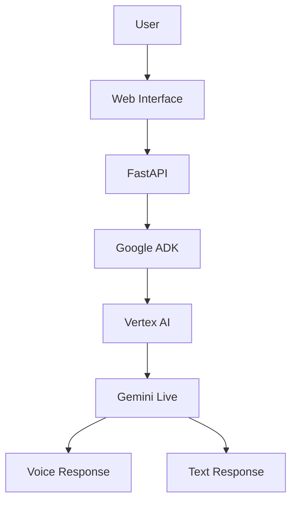

# Agent Valley Night Market

## Overview

Conversational AI agent developed using Google Agent Development Kit (ADK),
Vertex AI and Gemini Live.

## Architecture

## Documentation

| Document | Description |
|-----------|-------------|
| architecture.md | Solution Architecture |
| implementation.md | Technical Implementation |
| lessons-learned.md | Project Learnings |

## Technologies

- Google Cloud Platform
- Vertex AI
- Gemini Live
- Google ADK
- FastAPI
- Python
- JavaScript
- Cloud Shell

## Features

- Real-time conversational interaction
- Gemini Live integration
- Cloud-native deployment
- Audio and text communication
- Vertex AI orchestration

## Skills Demonstrated

### Cloud Engineering

- Google Cloud Project Configuration
- API Enablement
- Authentication Management

### Generative AI

- AI Agents
- Prompt Engineering
- Gemini Live

### Software Development

- FastAPI
- Python
- Frontend Integration

## Project Outcomes

- Built a functioning AI conversational agent.
- Configured Vertex AI services.
- Deployed and tested Google ADK components.
- Implemented a cloud-native AI workflow.

## Project Evidence

| Evidence | Description |
|-----------|-------------|
| cloudshell.png | Environment Setup |
| project-created.png | Google Cloud Project Creation |
| vertex-ai-enabled.png | Vertex AI Enabled |
| gemini-connected.png | Gemini Connected |
| setup-complete.png | Successful Deployment |
| demo.png | Running Application |

### Environment Setup

## Demonstración

