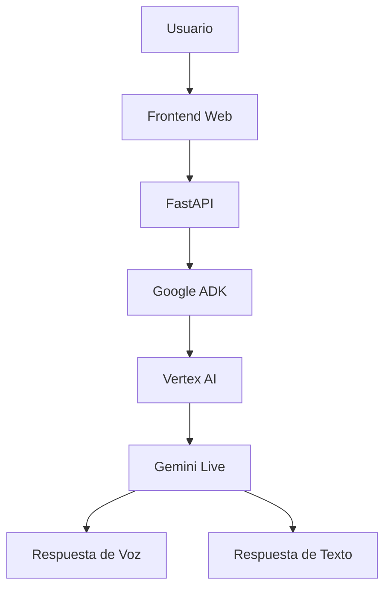

# Arquitectura de Solución

## Flujo

1. El usuario interactúa con la interfaz.
2. FastAPI recibe las solicitudes.
3. Google ADK coordina los agentes.
4. Vertex AI procesa las peticiones.
5. Gemini Live genera la respuesta.
6. La respuesta se devuelve en voz y texto.
