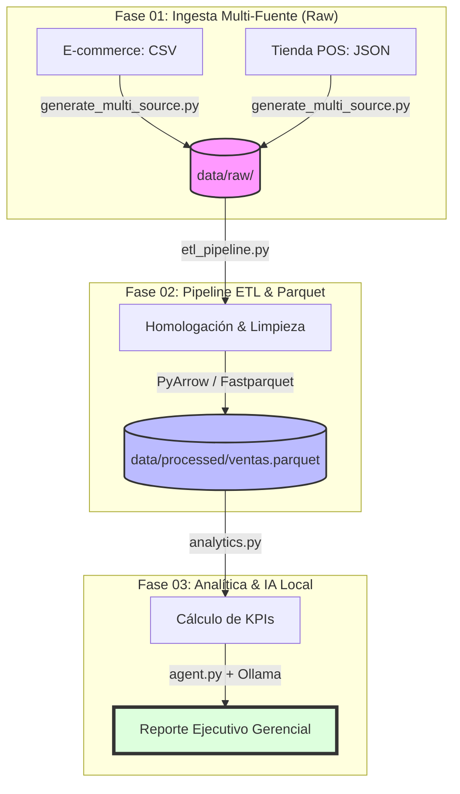

# 🤖 P8_AI_Copilot_BI — Copilot Analítico Local con IA y Multi-Source ETL

> *"Automatiza la ingesta de fuentes heterogéneas (CSV y JSON), optimiza el
> almacenamiento analítico mediante formatos columnares (Parquet) y genera
> insights ejecutivos con un Agente de IA local basado en Llama 3.2 (Costo
> cero y privacidad absoluta)."*

---

## 📋 Resumen Ejecutivo (Método STAR)

- **Situación:** Los equipos directivos y analíticos pierden horas valiosas
    transformando datos crudos dispersos en reportes ejecutivos e interpretando
    tendencias de forma manual.
- **Tarea:** Diseñar y desplegar una arquitectura de datos robusta y un Agente
    de IA local autónomo capaz de unificar fuentes heterogéneas, calcular
    indicadores clave de rendimiento (KPIs) y redactar análisis de negocio
    estructurados sin depender de APIs de pago.
- **Acción:** Se desarrolló una arquitectura modular en Python integrando un
    generador multi-origen (`raw/`), un pipeline ETL de homologación con salida
    en formato columnar **Parquet** (`processed/`), y un conector inteligente
    con **Ollama** (`llama3.2`) operando en un entorno local seguro.
- **Resultado:** Un sistema automatizado de extremo a extremo que reduce el
    tiempo de análisis exploratorio a segundos y entrega reportes listos para la
    toma de decisiones gerenciales con gobernanza y atomicidad.

---

## 🎯 Objetivo del Proyecto

Construir una solución de **AI Data Analyst** desacoplada que combine la
potencia de la automatización de datos moderna con grandes modelos de lenguaje
locales, cumpliendo con los más altos estándares de gobernanza y reutilización
de código (*Estándar Dzib V13.0*).



---

## 🏗️ Estructura Completa del Repositorio (Modular)

```plaintext
P8_AI_Copilot_BI/
│
├── architecture/          # Diagramas conceptuales y físicos
├── data/                  
│   ├── raw/               # Fuentes heterogéneas (CSV, JSON)
│   └── processed/         # Almacenamiento optimizado (Parquet)
├── docs/                  # Documentación técnica y de negocio
│   ├── decisions/         # ADRs (Architecture Decision Records)
│   ├── functional/        # Requerimientos de negocio
│   ├── operations/        # Guías de despliegue y uso
│   └── technical/         # Especificaciones de componentes (pipeline_design.md)
├── reports/               # Reportes ejecutivos generados por el agente
├── src/                   # Código fuente modular
│   ├── generate_multi_source.py # Simulador de fuentes heterogéneas
│   ├── etl_pipeline.py          # Unificación y exportación a Parquet
│   ├── analytics.py             # Motor de cálculo de KPIs
│   ├── agent.py                 # Conector y lógica con Ollama
│   ├── config.py                # Configuración por variables de entorno (.env)
│   ├── main.py                  # Orquestador maestro
│   ├── report_generator.py      # Exportador de reportes ejecutivos
│   └── tools.py                 # Validadores y herramientas de soporte
├── tests/                 # Pruebas unitarias automatizadas (pytest)
├── README.md              # Documentación principal del módulo
└── requirements.txt       # Dependencias del proyecto
```

---

## 🛠️ Stack Tecnológico

Lenguaje: Python 3.10+

Procesamiento y Columnar: Pandas, PyArrow (Parquet)

Inteligencia Artificial Local: Ollama (Llama 3.2)

Control de Versiones: Git / Git Flow / Variables de entorno (dotenv)

### 🚀 Guía de Replicación y Ejecución del Pipeline

Para desplegar y ejecutar este proyecto de extremo a extremo en tu equipo local:

1.- Asegúrate de tener Ollama corriendo con el modelo base:

```PowerShell
ollama pull llama3.2
```

2.- Instala las dependencias del proyecto:

```PowerShell
pip install -r requirements.txt
```

3.- Generar fuentes de datos heterogéneas (Simulación multi-origen):

```PowerShell
python P8_AI_Copilot_BI/src/generate_multi_source.py
```

4.- Ejecutar el pipeline ETL y compilar a formato Parquet:

```PowerShell
python P8_AI_Copilot_BI/src/etl_pipeline.py
```

5.- Ejecutar el orquestador principal (Agente analítico de IA):

```PowerShell
python P8_AI_Copilot_BI/src/main.py´
```

6.- Ejecutar la suite de pruebas unitarias (QA):

```PowerShell
pytest -v
```

Autor: Jesús Alberto Dzib Ku

Versión: 2.0.0
