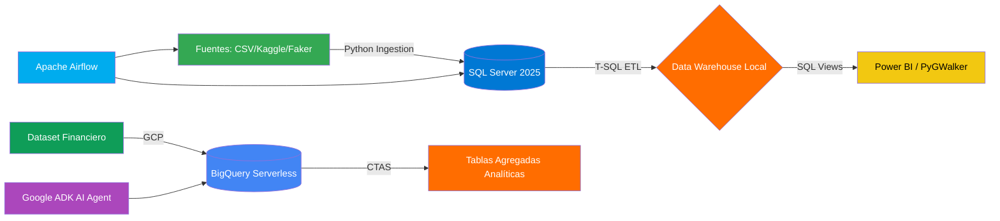
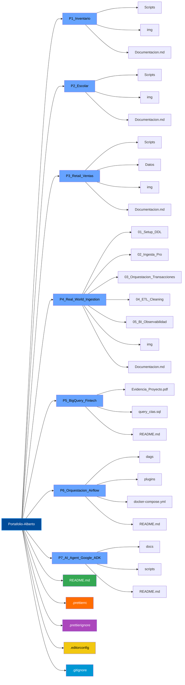

# 🚀 Enterprise Data Engineering Portfolio - 👷 Alberto Dzib 📊

> "Construyendo sistemas que no solo procesan datos,
> sino que cuentan historias de negocio y valor operativo."


[](https://github.com/dzib/Portafolio-Alberto/actions/workflows/ci.yml)


> 👨‍💻 Perfil Profesional
>
> 📖 ¡Bienvenido a mi portafolio!
> **Ingeniero de Datos & Consultor Independiente** especializado en
> arquitecturas de alto rendimiento, resiliencia de bases de datos y
> migración de sistemas legacy. Experto en transformar entornos críticos y
> metadatos desestructurados en ecosistemas de información optimizados
> mediante el **Dzib Standard (V3.0.0).**

**Core Stack:** `SQL Server 2025` | `Python 3.13` | `Git Flow` |
`Excel BI (ODBC)` | `Google Cloud Platfor`

---

## 📌 Incluye

- Tablas jerárquicas y normalizadas.
- Diversidad temporal en registros.
- Ejemplos prácticos para dashboards y BI.
- Pipelines validados mediante pruebas automatizadas (`pytest`).
- Este portafolio aporta valor como base técnica para proyectos de
  transformación digital y ciencia de datos.

## -🔑 Propósito del Proyecto -

Este portafolio nace de la necesidad de contar con ejemplos
**realistas y reproducibles** en análisis de datos,
sin comprometer información privada de empresas.
Con el objetivo de demostrar una evolución técnica y profesional,
reflejando estándares de nivel senior en
**Ingeniería de Datos y Business Intelligence**.
Cada proyecto integra arquitecturas robustas,
automatización de pipelines, control de calidad de datos
y prácticas modernas de desarrollo.

---

## 🎯 Objetivos del Portafolio Técnico

Su objetivo es servir como **biblioteca abierta de ejercicios**
y como referencia de portafolio profesional para quienes buscan
demostrar habilidades en BI, ETL y visualización de datos.

- Desarrollo de arquitecturas de grado empresarial aplicadas
  a casos de uso de negocio reales.
- 🗂️ **Modelado de Datos:** Diseño de esquemas relacionales robustos con
  integridad referencial y reglas de negocio complejas.
- 📈 **Ingesta de Alto Rendimiento:** Generación y procesamiento masivo de
  datasets realistas optimizando la latencia de escritura.
- ⏳ **Análisis Temporal:** Estructuración de series de tiempo y diversidad
  cronológica para análisis de tendencias de negocio.
- 🔍 **Disponibilidad Analítica:** Creación de vistas analíticas optimizadas
  para herramientas de BI y toma de decisiones.
- 🧪 **Calidad y CI/CD:** Validación automatizada de esquemas e integridad
  mediante pruebas unitarias y flujos de integración continua.

---

## 💻 Stack Tecnológico

En este portafolio se buscó aplicar un rigor de ingeniería en cada línea de código:

- **Motores:** SQL Server 2025 | SSMS 22.
- **Lenguajes:** T-SQL Avanzado y Python 3.13 (Pandas, SQLAlchemy).
- **Orquestación y Calidad:** Apache Airflow, Pytest, GitHub Actions.
- **Metodología de Calidad:**
  - **Idempotencia:** Scripts re-ejecutables sin duplicidad de datos
    (CREATE OR REPLACE).
  - **Integridad:** Uso de Transacciones (`COMMIT`/`ROLLBACK`) y bloques `TRY/CATCH`.
  - **Git Flow:** Gestión de ramas (`Feature` -> `Develop` -> `Main`) y `SemVer`.

---

## 🛠️ Estándares y Prácticas de Ingeniería Aplicadas

- **Integración Continua (CI/CD):** Workflows automatizados en
  `GitHub Actions` (`ci.yml`) para validación de código y pruebas en entornos limpios.
- **Calidad de Datos (Data Quality):** Pruebas unitarias automatizadas con
  `pytest` tanto a nivel global (`/tests`) como específico por proyecto (`P5`).
  - **Metodología de Calidad:**
    - **Idempotencia:** Scripts re‑ejecutables sin duplicidad de datos
      (CREATE OR REPLACE).
    - **Integridad:** Uso de Transacciones (`COMMIT`/`ROLLBACK`) y bloques `TRY/CATCH`.
    - **Performance:** Monitoreo de tiempos de ejecución en milisegundos
      para procesos masivos.
- **Lenguajes:** T-SQL Avanzado y Python 3.13 (Pandas, SQLAlchemy).
- **Arquitectura Modular:** Separación clara de responsabilidades
  en los flujos de extracción, transformación y carga (ETL/ELT).
- **Motores:** SQL Server 2025 | SSMS 22.
- **Control de Versiones Profesional:** Estrategia de ramas estructurada
  mediante `feature branches -> develop -> main` **(Git Flow)**.

### Matriz de Competencias Técnicas (Key Skills)

<!-- markdownlint-disable MD013 -->


|   Tecnología   |                                                           Badges                                                           |                                           Especialidad y Dominio                                           |
| :---------------: | :--------------------------------------------------------------------------------------------------------------------------: | :-----------------------------------------------------------------------------------------------------------: |
|   SQL Server   |  |            Arquitecturas de alto rendimiento,**Single-Pass Processing** , y normalización 1NF.            |
|     Python     |                                                      | Orquestación de pipelines, manipulación de grandes volúmenes de datos y automatización de procesos ETL. |
|    Data Viz    |                                                    |     Creación de dashboards interactivos, análisis exploratorio de datos (EDA) y reportes ejecutivos.     |
|  Data Quality  |                                                  |        **Data Cleansing** avanzado: corrección de acentos, capitalización y atomicidad semántica.        |
| Infraestructura |                              | Gestión de versiones, automatización de servicios de SO y configuración de entornos de alto rendimiento. |

<!-- markdownlint-enable MD013 -->

---

### Diagrama de Arquitectura Global



---

### 🛡️ Gobernanza de Datos y Calidad Verificada (Dzib Standard V3.0)

Este portafolio incorpora un sistema automatizado de control y auditoría interna
 para garantizar la máxima calidad técnica:

* **Integridad de Enlaces:** Verificación global automatizada que asegura un
 **100% de enlaces internos y externos funcionales**
  (0 enlaces rotos).
* **Reportes de Cumplimiento:** Métricas de estructura, nomenclatura y formato
 validadas mediante scripts ejecutables
  en `reports/portfolio_compliance.csv`.
* **Control Semántico:** Estandarización de tipos de datos, atomicidad rigurosa
 y nomenclatura unificada en motores relacionales y cloud.

### 🔍 Observabilidad y Resiliencia Operativa

* **Monitoreo de Pipelines (Airflow):** Gestión de flujos automatizados con
 manejo de reintentos automáticos, aislamiento en contenedores y control de
  salud de tareas mediante Apache Airflow (`P6`).
* **Stress Testing e I/O:** Pruebas de carga masiva en flujos de ingesta (`P4`)
 con optimización de hardware para garantizar un rendimiento óptimo de
escritura a escala industrial.

---

## 📊 Métricas de Impacto y Performance (Hito v3.0)

> *Benchmarks ejecutados en entorno local optimizado (SSD Expansion & Write Caching).*

<!-- markdownlint-disable MD013 -->


| **Categoría** |  **Métrica**   |       **Benchmark**        |  **Proyecto**   | **Estado** |
| :-----------: | :------------: | :------------------------: | :-------------: | :--------: |
| **AI Agent**  | **Deployment** | **Google ADK Integration** | **P7_AI_Agent** |     🤖      |

<!-- markdownlint-enable MD013 -->

---

## 📇 Estructura del repositorio

El repositorio está organizado por proyectos independientes, cada uno con su
propio ciclo de vida (DDL, DML, ETL y BI), bajo principios de arquitectura
modular y CI/CD.

Este portafolio está diseñado para ser reproducible y mantener un estilo
consistente en todo el código y la documentación.

Se incluyen archivos de configuración clave: `.prettierrc`, `.prettierignore`,
`.editorconfig` y `.gitignore`.

- `📂 P1_Inventario`: Gestión de stock y fundamentos relacionales.
- `📂 P2_Escolar`: Arquitectura avanzada, esquemas segregados y limpieza con CTEs.
- `📂 P3_Retail_Ventas`: Pipeline híbrido (Python + SQL) y procesamiento de
  Big Data.
- `📂 P4_Real_Word_Ingestion`: Soluciones con enfoque en Cadenas de
  Suministro y Eficiencia Logística.
- `📁 P5_BigQuery_Fintech`: Agregación de datos y creación de tablas nativas
  en Google Cloud Platform.
- `📂 P6_Orquestacion_Airflow`: Orquestación de flujos de trabajo con Apache Airflow.
- `📁 P7_AI_Agent_Google_ADK`: Implementación de un agente de IA para
  automatización de procesos en la nube.
- `📂 .github`: Contiene flujos de trabajo de CI/CD y plantillas de issues.
- `📂 .venv`: Entorno virtual de Python para reproducibilidad de dependencias.
- `📂 .vscode`: Configuración de entorno de desarrollo para VS Code.
- `📂 .github/workflows`: Contiene los flujos de integración continua (CI/CD)
  para validación de código y pruebas unitarias.
- `📂 tests`: Pruebas unitarias automatizadas para cada proyecto.
- `📂 Scripts`: Contiene scripts SQL y Python para cada proyecto.
- `📂 img`: Evidencias gráficas y dashboards de cada proyecto.
- `📝 README Y DOCUMENTACIÓN :` Documentación por proyecto de sus
  estándares y "Lineamientos de Estructura" aplicados.

```text
SQL_Portafolio/
├── 📂 .github/workflows/         # Pipeline de Integración Continua (ci.yml)
├── 📂 tests/                     # Pruebas unitarias globales y calidad de datos
├── 📂 P1_Inventario/             # Gestión de Stock y Fundamentos Relacionales
│   ├── Scripts/                   # Pipeline SQL (01-05)
│   ├── img/                       # Evidencias gráficas
│   └── 📄 README.md
│
├── 📂 P2_Escolar/                 # Arquitectura Avanzada y ETL con CTEs
│   ├── Scripts/                    # Pipeline SQL (01-05)
│   ├── img/                        # Evidencias de métricas
│   └── Documentacion.md
│
├── 📂 P3_Retail_Ventas/           # Pipeline Híbrido Big Data (Python + SQL)
│   ├── Scripts/                    # Scripts .py y .sql
│   ├── Datos/                      # Datasets generados (50k registros)
│   ├── img/                        # Dashboards de Analítica
│   └── 📄 README.md
│
├── 📂 P4_Real_World_Ingestion/    # Supply Chain & Observabilidad
│   ├── 01_Setup_DDL/               # Esquemas y constraints
│   ├── 02_Ingesta_Pro/             # Orquestación Python (23.8k reg/seg)
│   ├── 03_Orquestacion_Trans/      # Lógica transaccional TRY/CATCH
│   ├── 04_ETL_Cleaning/            # Normalización y detección de anomalías
│   ├── 05_BI_Observabilidad/       # Vistas SQL y Dashboard PyGWalker
│   ├── img/                        # Evidencias de performance y BI
│   └──📄 README.md                # Documentación de la ingesta
│
├── 📁 P5_BigQuery_Fintech/
│   ├── tests/                      # Pruebas unitarias específicas para BigQuery
│   ├── Evidencia_Proyecto.pdf      # Presentación para Drive/OneDrive
│   ├── query_citas.sql             # Script de SQL
│   ├── loan_count_by_year.csv      # Los datos exportados
│   ├── Script_BigQuery.sql         # El script de SQL para BigQuery
│   ├──img/                         # Tu captura de la consola GCP
│   └──📄 README.md                 # Presentación para GitHub
│
├── 📁 P6_Orquestacion_Airflow/     # Orquestación de pipelines y DAGs
│   ├── dags/                       # Flujos de trabajo automatizados
│   ├── image/                      # Evidencias visuales de Airflow
│   ├── logs/                       # Logs de ejecución de Airflow
│   ├── plugins/                    # Plugins personalizados de Airflow
│   ├── docker-compose.yml          # Configuración de contenedores para Airflow
│   │                                  Despliegue de infraestructura local
│   └──📄 README.md                 # Documentación de orquestación
│
├── 📁P7_AI_Agent_Google_ADK/               # Implementación agent-valley-nightmarke
│   ├── docs/
│   │   ├── architecture/
│   │   │   └── architecture.md              # Documentación profunda de diseño
│   │   ├── screenshots/
│   │   │   └── architecture-diagram.png     # Evidencia visual
│   │   ├── implementation.md                # Bitácora técnica y retos superados
│   │   └── lessons-learned.md               # Conclusiones y optimización
│   │                                        de costos en Cloud
│   ├── scripts/
│   │   ├── setup_codelab.sh             # Scripts de configuración
│   │   └── setup_project.sh
│   └── 📄 README.md                     # Caso de estudio y resumen ejecutivo
│
├── 📄 README.md                 # Documentación maestra del portafolio
├──  .prettierrc                 # Reglas de estilo de código (JSON)
├──  .prettierignore             # Archivos ignorados por Prettier
├──  .editorconfig               # Reglas universales de indentación y formato
└──  .gitignore                  # Archivos ignorados por Git
```

### 📊 Diagrama de Estructura del Portafolio



---

## **🏢 Casos de Negocio: Impacto de la Ingeniería de Datos**

### **🛒 Retail & Global Supply Chain**

**Inspiración:** Corporación multinacional con enfoque retail

- **Problema:** Inconsistencias en el estatus de entrega y pérdidas financieras
  ocultas por datos mal tipados.
- **Solución:** Pipeline híbrido que ingesta 180,000 registros, detecta anomalías
  financieras mediante **SQL dinámico** y normaliza el riesgo de entrega.
- **Impacto:** Visibilidad total del 100% de la cadena de suministro con
  métricas de eficiencia por región en tiempo real.

### **🏭 Manufactura y Logística (Inspiración: AB InBev)**

- **Problema:** Cuellos de botella en la carga de inventarios masivos que
  retrasan la toma de decisiones operativa.
- **Solución:** Optimización de I/O a nivel de hardware y uso de
  `fast_executemany` en Python para reducir tiempos de carga en un 90%.
- **Impacto:** Reducción del tiempo de procesamiento de minutos a segundos,
  permitiendo reportes de inventario subsegundo.

---

## 📁 Proyectos destacados

### 🤖 \[P7\] AI Agent with Google ADK (v5.4.0) - Release Oficial

*Implementación de agentes inteligentes y analítica avanzada asistida por IA.*

- **Arquitectura:** Diseño modular bajo Google ADK con flujos estructurados de
  gobernanza y Vertex AI (Gemini Live).
- **Trazabilidad:** Publicado bajo la versión oficial **v5.4.0** del
  portafolio corporativo.

### 🔄 \[P6\] Orquestación de Procesos con Apache Airflow

*Automatización y gestión de flujos de trabajo orientados a datos.*

* **Orquestación:** Diseño y estructuración de DAGs para la ejecución
  secuencial de tareas ETL.
* **Resiliencia:** Manejo de reintentos automáticos ante fallos de conexión
  y alertas operativas mediante Docker Compose local.

### ☁️ \[P5\] Google Cloud BigQuery: Fintech Analytics (v1.0.0) - Nuevo

*Procesamiento analítico en la nube y creación de tablas agregadas.*

* **Performance:** Optimización de consultas analíticas utilizando el motor
  serverless de BigQuery.
* **Ingeniería:** Uso de sintaxis **CTAS**
  (`CREATE OR REPLACE TABLE AS SELECT`) para la consolidación de métricas
  financieras.
* **Data Quality:** Idempotencia en la nube aplicando estándares de
  nomenclatura, convención de nombres y tipado automático de esquemas.
  Pruebas unitarias específicas (`test_pipeline_fintech.py`) para
  validar esquemas e idempotencia.
* **Key Skills:** Cloud Data Warehousing, Google Cloud Platform (GCP),
  Análisis Exploratorio de Datos.

### 🛒 \[P4\] Global Supply Chain Analytics (v4.0.0)

*Ingesta de datos reales (Kaggle) y visualización de vanguardia.*

- **Performance:** Ingesta récord de **180,000 registros** a **23.8k reg/seg**.
- **Ingeniería:** Detección de anomalías financieras e integridad post-DDL
  mediante **SQL Dinámico**.
- **BI:** Dashboard interactivo integrado en VS Code con **PyGWalker** para
  análisis exploratorio.
- **Key Skills:** Data Analytics, Troubleshooting de Entorno, Orquestación Transaccional.

### 🐍 \[P3\] Pipeline Híbrido de Alto Rendimiento: Retail (v3.1.0)

*Integración avanzada de Python y SQL para optimización de I/O y procesamiento
  de flujos veloces.*

- **Ingesta:** Generación y carga masiva de **50,000 registros** en **1.84
  segundos** mediante subprocesos híbridos.
- **ETL:** Normalización de metadatos no atómicos mediante **CTEs** y
  actualización por lotes (809 ms).
- **BI:** Reporte analítico automatizado en consola con **Pandas**,
  logrando tiempos de respuesta de **0.53 s**.
- **Key Skills:** Orquestación híbrida, Middleware ODBC,
  Optimización de I/O en hardware.

### 🎓 \[P2\] Sistema de Gestión Académica (P2_Escolar / v2.1.0)

*Ecosistema escolar resiliente con triple extracción y analítica presupuestaria.*

- **Estructura:** Diseño de esquemas segregados (`Catálogos`, `Operaciones`)
  aplicando control transaccional estricto.
- **Calidad:** Implementación de bloques **TRY/CATCH**, transacciones y
  manejo de desbordamientos decimales.
- **ETL:** Transformación de strings complejos en datos tipados (`DATETIME2`, `DECIMAL`).
- **Key Skills:** Window Functions (RANK), Idempotencia (`RESEED`),
  Constraints Nominados.

### 📦 \[P1\] Control de Inventarios (v2.0 - Retrofitting)

*De Fundamentos Relacionales a Pipeline para alta Eficiencia.*

* **Resiliencia Atómica:** Capacidad de reconstrucción total del entorno tras
  fallos críticos, optimizando el performance en un **80%**.
* **ETL Senior:** Pipeline híbrido que procesa 1,000 registros en **31ms** ,
  normalizando metadata sucia mediante CTEs y Single-Pass Processing.
* **Business Intelligence:** Dashboard operativo omnicanal en Excel (Modo
  Oscuro) conectado vía **ODBC**, con semaforización logística automatizada
  para el control de stock crítico y análisis de tendencias de ventas.
* **Stress Testing:** Simulación de carga masiva de 5,000 registros con
  blindaje proactivo contra nulos.

### 🧪 Ejecución Local de Pruebas (Pytest)

Para verificar la integridad del repositorio y ejecutar el motor de pruebas
unitarias localmente:

```bash
# Instalar dependencias del entorno de pruebas
pip install pytest

# Ejecutar pruebas globales y específicas de proyectos
pytest -v
```

---

#### 💎 El Valor de la Ingeniería: Transformación de Datos (ETL)

*Simulación de migración de un sistema Legacy con datos no atómicos a una
arquitectura optimizada para BI.*


|   Dimensión   | Estado Legacy (Origen) | Estado Optimizado |
| :--------------: | :----------------------: | :-----------------: |
| **Atomicidad** |      `Prod_Ref_3      |        V3`        |
| **Geografía** |       `queretaro       |       QRO`       |
|  **Estatus**  |        `PAGADO        |    COMPLETADO`    |
| **Ubicación** |    `Sucursal Norte    |      Merida`      |

> **Impacto:** Esta normalización eliminó el 100% de los registros duplicados en
> los reportes de ventas y redujo el tiempo de procesamiento de limpieza a
> **309ms**.

---

## 🌐 Estándares aplicados

En cada proyecto aplico rigor de ingeniería para asegurar código de nivel empresarial:

1. **Idempotencia:** Scripts capaces de ejecutarse múltiples veces sin
   corromper datos mediante `DROP IF EXISTS` y `DBCC CHECKIDENT`.
2. **Seguridad Transaccional:** Garantía de integridad mediante bloques
   `TRY/CATCH` y `ROLLBACK` ante fallos críticos.
3. **CI/CD Automatizado:** Validación de sintaxis y pruebas en cada
   actualización mediante GitHub Actions.
4. **Git Flow:** Estrategia de branching profesional (feature -> develop -> main).
5. **Métricas de Performance:** Optimización I/O, documentación obligatoria de
   tiempos de ejecución y carga de CPU.
6. **Documentación de Retos:** Enfoque en la resolución de problemas técnicos
   (Bug fixes & Refactoring).
7. **Middleware:** Integración vía ODBC Driver 17 y SQLAlchemy para flujos híbridos.

---

## **⚠️ Retos Técnicos y Resolución de Problemas (Troubleshooting)**

A lo largo del portafolio, se han documentado y resuelto desafíos críticos de
ingeniería que simulan entornos de producción real:

- **Ingesta de Datos a Escala Industrial:** Superación de cuellos de botella en
  la red mediante el uso de `fast_executemany` y optimización de I/O en
  hardware, logrando el récord de **23.8k reg/seg**.
- **Gestión de Metadatos y SQL Dinámico:** Resolución de conflictos de
  compilación al modificar esquemas en tiempo real (DDL/DML) mediante el uso
  de `sp_executesql` y manejo de lotes de ejecución.
- **Integridad de Datos en Pipelines Híbridos:** Gestión de valores `NULL` y
  colisiones de tipos de datos tras la migración de archivos crudos
  (CSV/Excel) hacia motores relacionales.
- **Git Flow:** Estrategia de branching profesional (`feature` ➔ `develop` ➔ `main`).
- **Higiene y Salud del Ecosistema:** Control manual de servicios de base de
  datos (`sqlon/sqloff`) y configuración de entornos aislados (`.venv`) para
  garantizar la portabilidad y el rendimiento. Uso mandatorio de
  `TRY...CATCH`, `ROLLBACK` y SARGability para eficiencia de CPU.
- **Recuperación Crítica y Resiliencia (Recovery & Reset):** Gestión exitosa de
  un fallo total del entorno de desarrollo. Reconstrucción del ecosistema (SQL
  Server 2025, Drivers ODBC, Python Venv), logrando una mejora del **80% en el
  performance** del pipeline tras la reinstalación.

---

## **💾 Guía de Uso del Repositorio**

Este portafolio está diseñado para ser auditable y reproducible:

1. **Exploración por Proyectos:** Cada carpeta (`P1` a `P7`) contiene
   su respectiva estructura de código y documentación técnica.
2. **Documentación de Proyecto:** Cada subcarpeta incluye su propio
   `README.md`, detallando métricas de performance específicas y evidencias
   visuales (`/img`).
3. **Requisitos de Entorno:**
   - SQL Server 2025 | SSMS 22.
   - Python 3.14 con librerías `pandas`, `sqlalchemy`, `pyodbc`, `pygwalker`.
   - Driver ODBC 17 para SQL Server.
   - Apache Airflow (Docker local para P6).
   - Cuenta activa de Google Cloud Platform (para P5 y P7).

---

## 🚩 **Roadmap de Evolución**

Mi meta es la automatización total y la integración con la nube:

- [X]  Cloud Analytics (Logrado): Implementación de ecosistemas de consulta
  serverless en Google Cloud Platform (P5).
- [X]  **Cloud Bridge:** Migración de pipelines hacia **Azure SQL Database**
  y automatización con **GitHub Actions** (CI/CD).
- [X]  **Orquestación de Procesos:** Automatización de tareas masivas
  mediante Apache Airflow (P6).
  **Task Schedulers** y monitoreo de salud de datos.
- [X]  **AI Integration:** Agentes inteligentes con Google ADK (P7).

- []  **Dockerización (Próximo proyecto):** Implementación de contenedores
  Docker para orquestar servicios de SQL Server y Python de forma portable.
- []  **Visualización Avanzada:** Integración de los flujos analíticos actuales
  con **Power BI** mediante DirectQuery.

## 🌍 Impacto Comunitario

Este repositorio busca **democratizar el aprendizaje práctico** en
ingeniería de datos. Al ofrecer casos reproducibles y abiertos, permite que
cualquier persona pueda **demostrar sus habilidades técnicas** sin depender de
información confidencial de empresas.

---

### **👤 Sobre Mí**

**Ingeniero de Soluciones de Datos** con experiencia en ecosistemas
corporativos de alto nivel (**SAP HANA, Salesforce, KoboToolbox**). Mi enfoque
combina el rigor técnico del desarrollo de software con la visión estratégica
de la logística y la cadena de suministro (AB InBev). Especializado en
transformar datos crudos y desordenados en activos de información para la toma
de decisiones.

Experto en procesos de **Retrofitting de Datos**, transformando sistemas legacy
con inconsistencias en arquitecturas limpias y listas para Business
Intelligence.

---

📬 Conectemos

¿Tienes un reto de datos o buscas optimizar tus pipelines? Estoy listo para colaborar.

- [LinkedIn](https://www.linkedin.com/in/jesusalberto-dzib-ku/)
- [✉️ Email](mailto:dzibjesusalberto@gmail.com)

---

**Autor:** **Jesús Alberto Dzib Ku**
*Ingeniero de Datos | SQL & Python Developer*
⚖️ **Licencia MIT** © 2025-2026

> “Construyendo sistemas que no solo procesan datos, sino que cuentan historias.”

### Identidad profesional

> #TheDzibStandard #DataEngineering #V3.0.0

🚧 En constante evolución.

---
