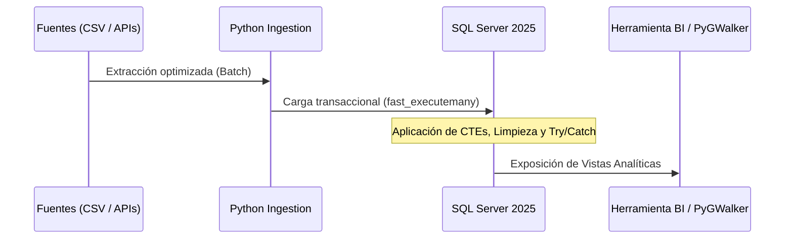

# 🔄 Flujo de Datos Técnico (Technical Data Flow)

Detalle de la ejecución de los pipelines a nivel de código y motor:

1. **Extracción:** Lectura optimizada por lotes mediante subprocesos en Python (`fast_executemany`).
2. **Transformación:** Aplicación de CTEs, funciones de ventana (`RANK`), y bloques
 `TRY/CATCH` para control de errores transaccionales en T-SQL.
3. **Carga:** Persistencia idempotente en bases de datos relacionales y
 ejecución de CTAS en entornos cloud.

## 🔄 Secuencia de Procesamiento

Fuente
↓
Ingesta
↓
Transformación
↓
Validación
↓
Almacenamiento
↓
Visualización
